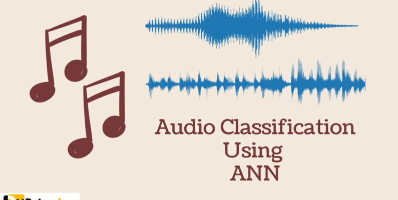

# Audio Classification


Our goal is audio classification on the sound in Farsi language. This can be done on any desired language just by changing the dataset.

## How to install
```
pip install -r requirements.txt
```

## How to create dataset

You can use the dataset that I uploaded on the [kaggle](https://www.kaggle.com/datasets/khadijehvalipour/audio-classification) site


nbconvert (a jupyter tool for notebook conversion) allows you to do this without any extra packages:

Just go to your terminal and type

``` 
jupyter nbconvert --to notebook --inplace --execute make_dataset.ipynb
```

## How to train

``` 
jupyter nbconvert --to notebook --inplace --execute train.ipynb
```

You can download the weight of the pre-trained voice classification model from this [link](https://drive.google.com/file/d/1N5_n8Q_3T1c1ChL3bTKbTD1atiwcGtsF/view?usp=drive_link)
